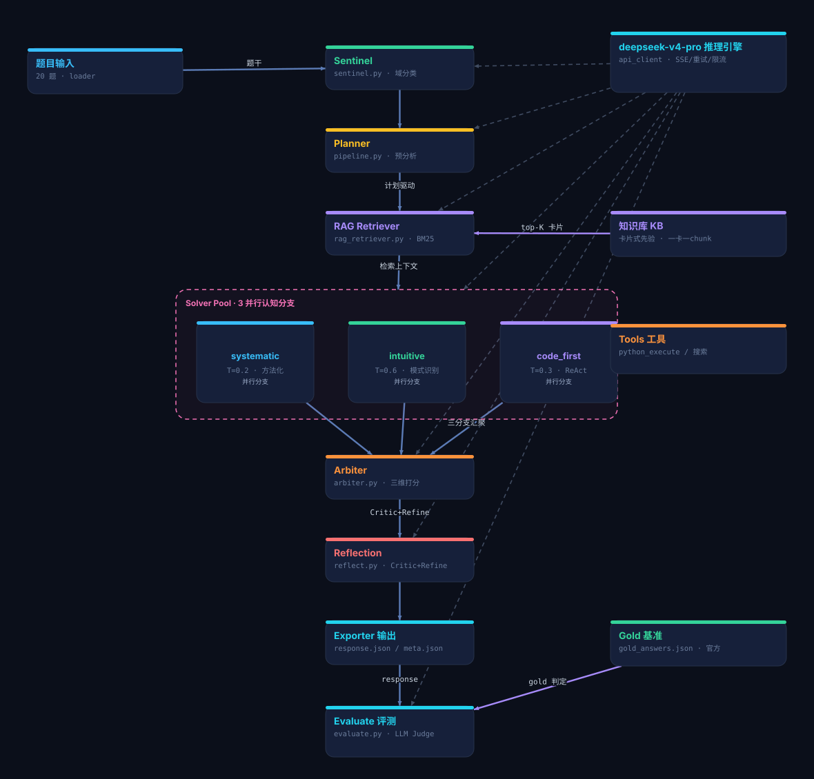

# HLE Solver Agent

一个面向 **Humanity's Last Exam (HLE)** 的多智能体解题系统。项目基于 [Fieldframe Labs FF-STACK](https://fieldframe.ai) 架构理念，使用 `deepseek-v4-pro` 作为唯一推理模型，通过 **Sentinel → Planner → RAG → Solver Pool →（分歧 Debate）→ Arbiter → Reflection → 后校验（多选逐判 / 数值复算）→ 置信度压缩** 的流水线完成高难度封闭问题的求解与评分。

---

## 1. 项目概述

- **目标**：对 `HLE_text_only_20questions_student.jsonl` 中的 20 道综合题进行自动化求解与评估。
- **核心模型**：`deepseek-v4-pro`（强制 thinking 模式，服务端地址 `https://api.ai-native-x.site/`）。
- **评测指标**：
  - **Accuracy**：最终答案正确率（含 95% 置信区间）。
  - **Calibration Error**：置信度校准误差（采用 HLE 官方 sorted-bucket L2 方法，beta=100）。
- **官方参考**：
  - HLE 仓库：https://github.com/centerforaisafety/hle
  - 评测脚本：https://github.com/centerforaisafety/hle/blob/main/hle_eval/run_judge_results.py

---

## 2. 系统架构



> 交互式版本（节点 + 箭头，可缩放查看）：[HLE_agent_architecture_diagram.html](HLE_agent_architecture_diagram.html)
> 图例：🔵 主流程 · 🟣 知识检索 · 🟠 工具循环(ReAct) · ⚪ 灰色虚线 = deepseek-v4-pro 驱动。

**执行顺序要点**：拿到题目后**先由 Planner 做预分析**，一次调用同时产出「分步解题计划 + 检索关键词」；随后用「题干 + 计划关键词」构造检索 query 做 RAG（计划驱动检索），再进入分支求解等后续流程。

### 2.1 模块说明

| 模块 | 文件 | 职责 |
|------|------|------|
| **Sentinel** | `hle_agent/sentinel.py` | 读取题目，进行基础预处理与题型分发。 |
| **Planner** | `hle_agent/pipeline.py` | **前置预分析**：生成分步解题计划 + 检索关键词，计划注入各分支 prompt，关键词驱动 RAG 检索。 |
| **RAG Retriever** | `hle_agent/rag_retriever.py` | 加载中英双语卡片式知识库（每题一张卡），**一张卡片=一个 chunk**（不做窗口切分），BM25 打分检索 top-K。 |
| **Solver Pool** | `hle_agent/solver.py` | 3 个并行认知分支：systematic、intuitive、code_first；每分支可自洽采样 k 次做多数投票（Self-Consistency）。code_first 分支采用 ReAct 式工具循环。 |
| **Arbiter** | `hle_agent/arbiter.py` | 汇总 3 个分支的候选答案与置信度，输出最终 `Explanation / Answer / Confidence`。 |
| **Reflection** | `hle_agent/reflect.py` | 反思闭环：Critic 审查三分支的事实/逻辑/数值错误，Refiner 产出修正版最终答案（非选择题启用）。 |
| **Multiselect** | `hle_agent/multiselect.py` | 多选组合题（select-all-that-apply）逐选项独立 True/False 判定后拼装组合答案，输出格式跟随题目要求。 |
| **Verifier** | `hle_agent/verifier.py` | ① 数值/`X:Y` 格式答案独立代码复算交叉验证；② 三分支分歧时触发 Debate 深挖（结论作为额外证据注入 Arbiter）；③ 置信度压缩校准 `min(conf, 40+0.5×conf)`。 |
| **API Client** | `hle_agent/api_client.py` | 统一封装 deepseek-v4-pro 的调用，支持 SSE 流式输出、工具调用、429/5xx 退避重试、全局并发信号量限流。 |
| **Tools** | `hle_agent/tools.py`, `tool_registry.py` | 内置 Python 代码执行、搜索等工具，供 code_first 分支使用。 |
| **Stream Logger** | `hle_agent/stream_logger.py` | 每题独立的 `reasoning.log`，支持 token 级实时推理日志。 |
| **Evaluate** | `evaluate.py` | 使用 deepseek-v4-pro 作为 judge，按官方方式判定对错并计算 Accuracy / Calibration Error；附带准精确匹配、分层统计与可靠性图。 |

---

## 3. 文件结构

```
HLE_agent/
├── hle_agent/
│   ├── __init__.py
│   ├── api_client.py          # API 调用、限流、重试、SSE 流式
│   ├── arbiter.py             # 仲裁器：汇总多分支输出
│   ├── config.py              # 全局配置（模型、并发、RAG top-k、超时等）
│   ├── loader.py              # 读取 .jsonl 数据
│   ├── multiselect.py         # 多选组合题逐选项判定子流程
│   ├── pipeline.py            # 完整解题流水线（Planner 前置 + 计划驱动 RAG + 后校验）+ 并行调度 + 编排级重试
│   ├── rag_retriever.py       # BM25 检索器（卡片式知识库，一卡一 chunk）
│   ├── reflect.py             # Reflection 反思闭环（Critic + Refine）
│   ├── verifier.py            # 数值复算 / 分歧 Debate / 置信度压缩
│   ├── sentinel.py            # 题目预处理
│   ├── solver.py              # 多分支 solver（systematic/intuitive/code_first + 自洽采样）
│   ├── stream_logger.py       # 每题独立推理日志
│   ├── tool_registry.py       # 工具注册表
│   └── tools.py               # 具体工具实现
├── knowledge_base/
│   ├── HLE_20_Problem_Type_Prior_Knowledge_EN_2026-07-30.md  # 英文卡片式先验知识库（20 张卡）
│   └── HLE_20题型先验知识库_CN.md                              # 中文卡片式先验知识库（20 张卡）
├── knowledge_base_README.md   # 知识库使用说明（已移出检索范围）
├── HLE_text_only_20questions_student.jsonl  # 20 道题目
├── gold_answers.json          # 20 题参考答案
├── run.py                     # 主入口：运行 agent
├── evaluate.py                # 评测入口：生成 EVAL_SUMMARY.md + judge_results.json
├── monitor_run.py             # 后台运行监控脚本
└── README.md                  # 本文档
```

---

## 4. 快速开始

### 4.1 环境要求

- Python 3.10+
- 已安装依赖：`numpy`, `scikit-learn`, `requests` 等（见 `hle_agent/rag_retriever.py` 与 `api_client.py`）
- API Key：项目已内置 `sk-EZwCtlLpzKIPNAn79YXVgEkjzFPcKKjQSmBYeSGSjxpWRVcm`

### 4.2 运行全部 20 题

```bash
python run.py --outdir outputs
```

- 默认并发：全部 20 题同时跑。
- 真实 API 并发请求被全局信号量限制为 `MAX_CONCURRENT_REQUESTS`（默认 10），避免打爆代理。
- 输出目录结构：

```
outputs/
├── 01_<qid>/
│   ├── response.json          # 该题完整输出（含 explanation / answer / confidence）
│   ├── meta.json              # 题号、ID、题型、题干
│   └── reasoning.log          # token 级实时推理日志
├── 02_<qid>/
│   └── ...
├── responses.jsonl            # 聚合后的 20 题输出
├── report.md                  # 运行报告
└── EVAL_SUMMARY.md            # 评测摘要（运行 evaluate.py 后生成）
```

### 4.3 运行评测

```bash
python evaluate.py --outdir outputs
```

评测结果写入：
- `outputs/EVAL_SUMMARY.md`：人类可读摘要
- `outputs/judge_results.json`：每题详细 judge 结果（可审计、可复用）

### 4.4 限制题数 / 调整并发

```bash
# 只跑前 5 题
python run.py --limit 5 --outdir outputs_test

# 只跑第 6 题（冒烟测试单题）
python run.py --only 6 --outdir outputs_smoke

# 显式指定并发数
python run.py --concurrency 10 --outdir outputs
```

---

## 5. 配置说明

主要参数在 `hle_agent/config.py`：

| 参数 | 默认值 | 说明 |
|------|--------|------|
| `API_BASE` | `https://api.ai-native-x.site/v1` | deepseek-v4-pro 代理地址 |
| `MODEL` | `deepseek-v4-pro` | 唯一使用的模型 |
| `MAX_CONCURRENT_REQUESTS` | `10` | 全局真实并发请求上限 |
| `MAX_RETRIES` | `4` | API 失败/限流重试次数 |
| `RETRY_BACKOFF` | `16` | 重试退避基数（秒） |
| `RAG_TOP_K` | `1` | 每题检索返回的知识卡片数（知识库一题一卡，top1 即命中本题卡片） |
| `ENABLE_MULTISELECT_JUDGE` | `True` | 多选组合题逐选项判定子流程 |
| `ENABLE_NUMERIC_VERIFY` | `True` | 数值/`X:Y` 格式答案代码复算 |
| `ENABLE_CONF_COMPRESS` | `True` | 置信度压缩校准（只压高不抬低） |
| `ENABLE_DEBATE` | `True` | 三分支分歧时触发 Debate 深挖 |
| `SOLVER_BRANCHES` | `systematic`, `intuitive`, `code_first` | 三个并行认知分支 |
| `ENABLE_PLANNER` | `True` | Planner 前置预分析（解题计划 + 检索关键词） |
| `SELF_CONSISTENCY_K` | 见 config | 每分支自洽采样次数（多数投票） |
| `ENABLE_REFLECTION` | `True` | Arbiter 后的 Critic+Refine 反思闭环 |
| `MAX_PIPELINE_RETRIES` | 见 config | 单题流水线失败的编排级重试次数（指数退避） |
| `REACT_MAX_ROUNDS` | `6` | code_first 分支 ReAct 工具循环最大轮数 |
| `REQUEST_TIMEOUT` | `180` | 单次请求超时 |

---

## 6. 输出格式

每道题的最终 `response.json` 包含：

```json
{
  "id": "66b91693d86bff9a12fc1f99",
  "question": "...",
  "response": "Explanation: ...\nAnswer: ...\nConfidence: 85%",
  "answer_type": "multiple_choice",
  "_meta": {
    "branches": { ... },
    "arbiter_reasoning": "...",
    "final_confidence": 85
  }
}
```

---

## 7. 评测方法

`evaluate.py` 已对齐 HLE 官方 `run_judge_results.py`：

1. **Judge Prompt**：使用官方模板，要求 deepseek-v4-pro 输出 JSON：
   - `extracted_final_answer`：从 response 提取的最终答案
   - `reasoning`：判定理由
   - `correct`：`yes` / `no`
   - `confidence`：从 response 提取的置信度（未找到则默认 100）
2. **Accuracy**：`correct == "yes"` 的比例，按总题数 n=20 计算，并给出 95% 置信区间半宽。
3. **Calibration Error**：
   - 按置信度排序后分桶（beta=100）
   - 计算桶内平均置信度与平均正确率的 L2 距离
   - 乘以 100 输出为百分比

---

## 8. 版本迭代

| 版本 | 关键改动 | 解决的问题 |
|------|----------|------------|
| v0.1 | 基础单题求解 + simple judge | 验证 deepseek-v4-pro 可用性 |
| v0.2 | 引入 Sentinel-Forge-RAG-Solver-Arbiter 多智能体架构 | 提升复杂题覆盖能力 |
| v0.3 | 三认知分支并行 + 流式推理日志 | 增加解题多样性，支持实时查看 |
| v0.4 | 全局并发信号量 + 文件夹命名 `NN_<qid>` + `meta.json` | 防止 60+ 并发打爆代理，输出更清晰 |
| v0.5 | 接入 `HLE_20Q_Agent_Knowledge_Base_EN.md`，检索策略 top4，章节感知的分块 | 提升 RAG 命中正确题型卡片的准确率 |
| v0.6 | 重写 `evaluate.py` 对齐官方 HLE 评分方法 | judge 更规范，指标可对比官方 |
| v0.7 | 官方 `hle_dataset.json` 重建 gold + 修复 judge 截断 bug | 评测结果可信（40.0% 基线） |
| v0.8 | **Planner 前置 + 计划驱动 RAG**；Reflection 反思闭环；Self-Consistency 自洽采样；ReAct 强化；BM25 + 一卡一 chunk；编排级重试；测评增强（准精确匹配/分层统计/可靠性图） | Accuracy 40.0% → **45.0%** |
| v0.9 | **多选逐选项判定**（`multiselect.py`）；**数值代码复算 + 分歧 Debate + 置信度压缩**（`verifier.py`）；检索 top2 | 对着 v0.8 失分点（多选组合/数值格式/过度自信）定向优化 |
| v0.9.1 | 修复 Debate 输出污染（DSML 标记泄漏）；空答案兜底不变量；**修复 tools 临时脚本批量删除触发宿主守卫杀进程的崩溃**；检索 top1 | Q11/Q13/Q20 新答对；CalibErr 66.18% → **60.42%** |

---

## 9. 注意事项

1. **强制 thinking 模型**：`deepseek-v4-pro` 默认返回 `reasoning_content` + `content`，无法关闭 thinking。
2. **全局限流**：即使 `--concurrency 20`，真实同时在飞的 API 请求也不会超过 `MAX_CONCURRENT_REQUESTS`（默认 10）。
3. **断点续跑**：`run.py` 会检测 `outputs/responses.jsonl`，已完成的题默认跳过；需要干净重跑时请手动清空 `outputs/`。
4. **gold answer 来源**：`gold_answers.json` 由官方 `hle_dataset.json`（2500 题完整集）重建，20 题 qid 全部精确匹配，为唯一评测基准。
5. **API 费用**：20 题 × 3 分支 × 自洽采样 × 多轮调用 + Reflection + judge，token 消耗较大，请在额度充足时运行。
6. **工具临时脚本不删除**：`tools.python_execute` 生成的临时脚本会留在 `.workbuddy/agent_tmp/`（执行后立即删除会触发宿主环境的安全删除守卫，单轮删满 50 次后进程会被终止——曾导致调用工具最多的 Q1 两次全程崩溃）。请定期人工清理该目录。

---

## 10. 最新运行结果

> 由 `evaluate.py --outdir outputs` 自动生成（2026-07-30）。
> 评测基准：**官方 `hle_dataset.json`**（20 题 qid 全部精确匹配），gold 以官方 `answer` 字段为准。
> 详见 `outputs/EVAL_SUMMARY.md` 与 `outputs/judge_results.json`。

| 指标 | v0.8 | **v0.9.1（当前）** |
|------|------|------|
| 已评测题数 | 20 / 20 | 20 / 20 |
| **Accuracy（LLM judge）** | 45.0% | **45.0%** |
| Accuracy（准精确匹配） | 45.0% | 35.0% |
| 95% CI 半宽 | ±21.8% | ±21.8% |
| **Calibration Error** | 66.18% | **60.42%** |
| 正确题数 | 9 / 20 | 9 / 20（Q2, Q6, Q8, Q9, Q10, Q11, Q13, Q16, Q20） |

v0.9.1 相对 v0.8 的逐题变化：
- **新增答对**：Q11（Overlap-add/save 63/69，数值复算修正）、Q13（`53.5:6`）、Q20（`A,B,C,D`，多选逐判补上了漏掉的 C）。
- **回退**：Q3（`butterfly` vs gold `humanity`）、Q12（`1.007:0`，两轮间不稳定）、Q1（本轮运行两次崩溃，最终以空答案计 0 分——崩溃根因是工具临时脚本批量删除触发宿主守卫杀进程，已修复但未重跑）。
- **校准明显改善**：置信度压缩后全部预测落在 75–89% 区间，CalibErr 从 66.18% 降至 60.42%，不再出现 95%+ 的过度自信。
- 分层：exactMatch 42.9%（6/14），multipleChoice 50.0%（3/6）。
- 详细分析见 `TEST_REPORT.md`。

> 说明：早期 5% 结果为双重失真——既用了错误的 `gold_answers.json`，又因 judge 截断 80k response 至 4000 字符而看不到答案。v0.7 用官方 gold + 修复截断后确立 40% 基线，v0.8 架构升级至 45%，v0.9.1 在持平 45% 的同时显著改善校准（Q1 若正常完成有望 50%——其崩溃前 Arbiter 答案与 gold 一致）。
